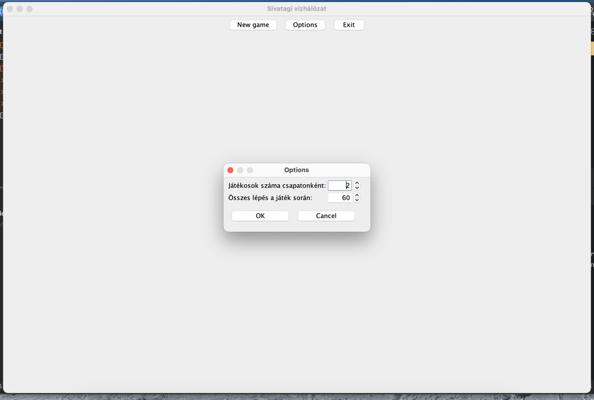
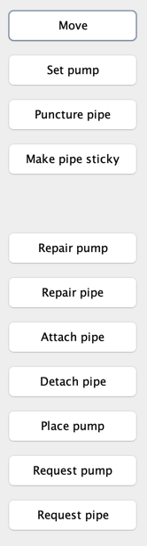
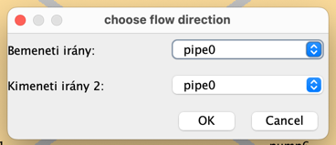

# Nem funkcionális jellemzők - biztonság
## Bemenetek
A program elindulása után, 3 gomb közül lehet választani:
- New game: a játék elindul az alapértelmezett értékekkel.
- Options: 
    - Játékosok száma csapatonként: egy numeric up-down szolgál bemeneti mezőként, viszont be lehet írni szöveget is. Ez az eset nincs lekezelve, nem dobódik hiba, de nem is érvényesülnek a beállítások, ha nem számmal kezdődik. Így az alapértelmezett értékkel indul a játék. Ha számmal kezdődik, akkor az a szám érvényesül. 
    - Összes lépés a játék során: hasonlóan az előző esethez.
    
- Exit: a program bezáródik

A játék közben a következő irányítási lehetőségek vannak gombok formájában:
- Move
- Set pump
- Puncture pipe
- Make pipe sticky
- Make pipe slippery
- Repair pump
- Repair pipe
- Attach pipe
- Detach pipe
- Place pump
- Request pump
- Request pipe

Mivel az irányításhoz nem szöveges bevitelt használunk, hanem gombokat, illetve listából választunk ki előre megadott elemeket, így nem lehet kártékony kódot bejuttatni a programba.

Ezeken kívül nincs más szabad beviteli lehetőség.

## Külső adatforrások
Nincs adatbázis és egyébb forrásfájl sem, amiből adatokat tölthet be a program. Így ezáltal nem szivároghat ki adat, illetve nem volt szükség titkosításra sem.

## Hitelesítés és hozzáférés
Nincsenek különböző hozzáféréssel rendelkező felhasználók. Mindneki ugyanazokat a funkciókat éri el és ugyanazt látja.