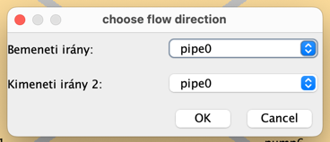

# Nem funkcionális jellemzők - használhatóság

## Lépéslehetőségek

- Túl sok gomb, könnyen összezavarodhat a felhasználó.
- Ikonok a szöveg mellé a könnyű felismerhetőség érdekében.
- Abszolút pozícionálás, a gombok nem reszponzívak.

## Információk

- A számok elhelyezése nem konzisztens. (pl. a számlálók)
- Nincs hierarchia a cím és az adatok között.
- Elválasztóvonal hiánya a különböző információk között.

## Játéktér

- Nem egyértelmű, hogy a felhasználó a csapaton belül melyik karaktert mozagtja.
- Karakterek kitakarják a pályaelemek neveit.
- Színek nem kontrasztosak, nehezen elkülöníthetőek.

## Lépés-menü

- Nehézkes a pályaelemek közötti váltás.
- Az enter nem működik, muszáj az 'OK' gombra kattintani.
- A dialógusablak kitakarja a pályát, adott esetben pont a releváns részt.
- Nincs jelezve, hogy a szerelő karakter melyik csövet tartja a kezében.

 

## Hibás kattintások

- Ha olyan lépést választunk, amit az adott pályaelemen az adott karakter nem tud, hibaüzenetet kapunk.
- Jobb lenne, ha egyáltalán nem lehetne a gombra kattintani.

## Beállítások

- Nem kell külön dialógusablak, a főablakban elférnek a beállítások.

## Cső mozgatása

- Nem egyértelmű, hogy melyik cső hova vezet.
- A jobb oldalon nem jelzi, hogy melyik csövet tartja kezében a karakter.

## Folyásirány beállítása

- Kimeneti irány 2??? Hol a kimeneti irány 1???
- "choose flow direction" most akkor angol vagy magyar?

