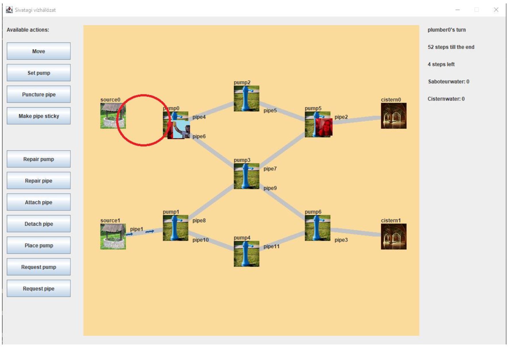

# Tesztjelentés
**Tesztelt program:** Sivatagi vízhálózat játék. 
**Felhasznált eszközök:** Visual Studio Code

## Tesztelés előtti megfigyelések
- A program az alábbi specifikáció alapján készült:

    “A program egy játék, melynek neve Sivatagi Vízhálózat. A vízhálózat csövekből, és a
csövekhez csatlakozó aktív elemekből áll, utóbbiak lehetnek napelemes pumpák, a
város ciszternái vagy hegyi források.
A játékban a szerelőknek kell biztosítani, hogy a csövekből és pumpákból álló
hálózaton keresztül a víz a hegyi forrásokból a városok ciszternáiba folyjon. Át tudják
állítani a pumpákat és meg tudják azokat javítani, ha elromlanak. Képesek továbbá
egy lyukas cső befoltozására, valamint a csövek végeit képesek mozgatni az aktív
elemek között. A szerelők célja, hogy minél több víz jusson el a város ciszternáiba,
ezért folyamatosan bővítik és alakítják a hálózatot.
A hálózaton megtelepedtek a nomád szabotőrök, akiknek egyetlen célja a városlakók
kiirtása. Ravasz tervük, hogy a hálózat tönkretételével megszüntessék a város
vízellátását, ezért kilyukasztják a csöveket és átállítják a pumpákat.
A szerelőket és a szabotőröket a felhasználók irányítják. A szerelők egy pontot kapnak
minden, a város ciszternáiba eljutott liter vízért, a szabotőrök hasonló mértékben, de
a homokba folyt vízért kapnak pontot.
A csövek rugalmasak, bármelyik cső összekötheti bármelyik két aktív elemet. A
szerelők a csövek egyik végét le tudják csatlakoztatni, és felcsatlakoztatni azt bármely
aktív elemhez. Ha egy csőben van vízáramlás, de a cső kilyukad, vagy az egyik vége
nincsen aktív elemhez csatlakoztatva, a csőből a víz a homokba folyik. A csövek
kapacitása egy liter víz másodpercenként.
Minden pumpához négy irányból, irányonként egy cső csatlakozhat, de vizet csak egy
hozzácsatlakozó csőből, egy másikba képes pumpálni, a többi cső el van zárva.
A ki- és bemeneti cső beállítására bármelyik játékos képes. A pumpák napelemmel
működnek, de a napelemek megbízhatatlan szerkezetek, véletlen időközönként
elromlanak. A pumpák megjavítása a szerelők feladata.
Egy csövet félbe lehet vágni, és a közepén egy pumpát elhelyezni. Ekkor a félbevágott
cső az elhelyezett pumpa két szemben lévő oldalához csatlakozik.
A hegyi forrásokhoz csöveket csatlakoztatva lehet a vízhálózatot vízzel ellátni. A
források a hozzájuk csatlakoztatott csövet folyamatosan ellátják vízzel. A ciszternák
biztosítják a város vízellátását. A szerelők dolga minél több vizet a ciszternákba
juttatni.
A ciszternáknál szorgos munkások folyamatosan csöveket készítenek. Ha egy
ciszternához nem csatlakozik cső, a munkások hozzácsatlakoztatnak egy újat, a másik
végét szabadon hagyják, hogy a szerelők bekapcsolhassák azt a hálózatba.
A szorgos munkások nem csak csöveket, hanem pumpákat is gyártanak. Ezeket a
szerelők képesek elvinni, és velük a vízhálózat zavarérzékenységét csökkenteni.
2
A sivatagban rengeteg kígyó és skorpió él, így sem a szabotőrök, sem a szerelők nem
lépnek a homokra, mozogni csak a hálózaton képesek.
A játékot egyszerre két felhasználó játszhatja, legalább két-két játékossal. Egy
felhasználó váltogathat, hogy éppen melyik játékost irányítja, a másik közben nem
mozdul. A játékidő a játék kezdete előtt beállítható, az a felhasználó nyer, aki több
pontot gyűjtött az adott idő alatt.”

- A program tesztelését fekete doboz technikával fogjuk elvégezni.
- A forrásfájlok áttekintése után jól elkülöníthető egy megjelenítési és egy logikai réteg.
- Indítás után egy egyszerű menü jelenik meg, ahol három lehetőség közül lehet
választani:
    - New game (Új játék)
    - Options (Beállítások)
    - Exit (Kilépés)
- Az “Options” gombra kattintva megjelenik egy párbeszédablak, ahol a játékosok
számát és a játék során tehető összes lépés maximumát állíthatjuk.
- A “New game” gombra kattintva elindíthatjuk a játékot. A pálya egy gráf formájában
kerül megjelenítésre. A bal oldalt található gombok segítségével vezérelhetjük a
játékot, jobb oldalt pedig a játék aktuális állását láthatjuk.

## Tesztesetek
1. Új játék indítása az alapértelmezettől eltérő beállításokkal.

    | Tesztelő neve | Teszt időpontja |
    | --- | --- |
    | Faragó Bálint | 2024.05.19. 09:03 |

    | Bemenet | Elvárt kimenet | Valós kimenet | 
    | --- | --- | --- |
    | [Options]  Játékosok száma csapatonként: 3  Összes lépés a játék során: 66  [OK]  [New game] | Elindul a játék csapatonként 3-3 játékossal és a játék során az összes lépés maximális száma 66. | A valós kimenet megegyezik az elvárt kimenettel. |

2. Játék közben a szerelő vagy szabotőr kiválasztja a Move műveletet.

    | Tesztelő neve | Teszt időpontja |
    | --- | --- |
    | Szász Dóra | 2024.05.19. 9:05 |

    | Bemenet | Elvárt kimenet | Valós kimenet | 
    | --- | --- | --- |
    | [Move] | A gomb kattintás hatására egy párbeszédablak jelenik meg, melyben a legördülő listában azok a pályaelemek jelennek meg, amelyek közvetlen szomszédosak a játékos aktuális tartózkodási helyével. | A valós kimenet megegyezik az elvárt kimenettel. |

3. Játék közben a szerelő és szabotőr Move műveletének végrehajtása.

    | Tesztelő neve | Teszt időpontja |
    | --- | --- |
    | Szász Dóra | 2024.05.19. 9:18 |

    | Bemenet | Elvárt kimenet | Valós kimenet | 
    | --- | --- | --- |
    | [Move]   Párbeszédablakban pipe6 kiválasztása a legördülő listából.  [OK] | A párbeszédablakban kiválasztott pályaelemre (pipe6) mozog a karakter. | A valós kimenet megegyezik az elvárt kimenettel. |

4. Játék közben a szerelő vagy szabotőr kiválasztja a Set pump műveletet.

    | Tesztelő neve | Teszt időpontja |
    | --- | --- |
    | Faragó Bálint | 2024.05.19. 09:10 |

    | Bemenet | Elvárt kimenet | Valós kimenet | 
    | --- | --- | --- |
    | [Set pump] | Amennyiben a játékos pumpán áll: A gomb kattintás hatására egy párbeszédablak jelenik meg, melyben mindkét legördülő listában az adott pumpához csatlakozó csövek jelennek meg.   Amennyiben a játékos nem pumpán áll: Felugró hibaüzenet. | A valós kimenet mindkét esetben megegyezik az elvárt kimenettel. |

5. Játék közben a szerelő vagy szabotőr Set pump műveletének végrehajtása.

    | Tesztelő neve | Teszt időpontja |
    | --- | --- |
    | Faragó Bálint | 2024.05.19. 09:19 |

    | Bemenet | Elvárt kimenet | Valós kimenet | 
    | --- | --- | --- |
    | [Set pump]   Párbeszédablakban a következő értékek kiválasztása a legördülő listákból:   - Bemeneti irány: pipe0   - Kimeneti irány: pipe4  [OK] | Amennyiben a játékos pumpán áll: A pumpa be- és kimeneti irányai beállításra kerülnek.    Amennyiben a játékos nem pumpán áll: Felugró hibaüzenet. | A valós kimenet mindkét esetben megegyezik az elvárt kimenettel. |

6. Játék közben a szerelő és szabotőr Puncture pipe műveletének végrehajtása.

    | Tesztelő neve | Teszt időpontja |
    | --- | --- |
    | Szász Dóra | 2024.05.19. 09:27 |

    | Bemenet | Elvárt kimenet | Valós kimenet | 
    | --- | --- | --- |
    | [Puncture pipe] | Amennyiben a játékos csövön áll: A gomb kattintás hatására az a cső, amelyen a játékos tartózkodik, elromlik, a grafikus felületen a cső színe pirosra változik.   Amennyiben a játékos nem csövön áll: Felugró hibaüzenet. | A valós kimenet mindkét esetben megegyezik az elvárt kimenettel. |

7. Játék közben a szerelő és szabotőr Make pipe sticky műveletének végrehajtása.

    | Tesztelő neve | Teszt időpontja |
    | --- | --- |
    | Szász Dóra | 2024.05.19. 09:34 |

    | Bemenet | Elvárt kimenet | Valós kimenet | 
    | --- | --- | --- |
    | [Make pipe sticky] | Amennyiben a játékos csövön áll: A gomb kattintás hatására az a cső, amelyen a játékos tartózkodik, ragadóssá válik, a grafikus felületen a cső színe sárgára változik.   Amennyiben a játékos nem csövön áll: Felugró hibaüzenet. | A valós kimenet mindkét esetben megegyezik az elvárt kimenettel. |

8. Játék közben a szabotőr Make pipe slippery műveletének végrehajtása.

    | Tesztelő neve | Teszt időpontja |
    | --- | --- |
    | Szász Dóra | 2024.05.19. 09:51 |

    | Bemenet | Elvárt kimenet | Valós kimenet | 
    | --- | --- | --- |
    | [Make pipe slippery] | Amennyiben a játékos csövön áll: A gomb kattintás hatására az a cső, amelyen a játékos tartózkodik, csúszóssá válik, a grafikus felületen a cső színe sárgára változik.   Amennyiben a játékos nem csövön áll: Felugró hibaüzenet. | A valós kimenet mindkét esetben megegyezik az elvárt kimenettel. |

9. Játék közben a szerelő kiválasztja a Repair pump műveletet.

    | Tesztelő neve | Teszt időpontja |
    | --- | --- |
    | Faragó Bálint | 2024.05.19. 09:27 |

    | Bemenet | Elvárt kimenet | Valós kimenet | 
    | --- | --- | --- |
    | [Repair pump] | Amennyiben a játékos pumpán áll: A pumpa megjavul.   Amennyiben a játékos nem pumpán áll: Felugró hibaüzenet. | A valós kimenet mindkét esetben megegyezik az elvárt kimenettel. |

10. Játék közben a szerelő kiválasztja a Repair pipe műveletet.

    | Tesztelő neve | Teszt időpontja |
    | --- | --- |
    | Faragó Bálint | 2024.05.19. 09:43 |

    | Bemenet | Elvárt kimenet | Valós kimenet | 
    | --- | --- | --- |
    | [Repair pipe] | Amennyiben a játékos csövön áll: A cső megjavul.   Amennyiben a játékos nem csövön áll: Felugró hibaüzenet. | A valós kimenet mindkét esetben megegyezik az elvárt kimenettel. |

11. Játék közben a szerelő kiválasztja a Detach pipe műveletet.

    | Tesztelő neve | Teszt időpontja |
    | --- | --- |
    | Szász Dóra | 2024.05.19. 10:15 |

    | Bemenet | Elvárt kimenet | Valós kimenet | 
    | --- | --- | --- |
    | [Detach pipe] | A gomb kattintás hatására egy párbeszédablak jelenik meg, melyben a legördülő listában az adott pumpához csatlakozó csövek jelennek meg. Amennyiben a játékos nem pumpán áll, vagy túl sok cső van adott pumpához csatlakoztatva): Felugró hibaüzenet. | A valós kimenet mindkét esetben megegyezik az elvárt kimenettel. |

12. Játék közben a szerelő kiválasztja az Attach pipe műveletet.

    | Tesztelő neve | Teszt időpontja |
    | --- | --- |
    | Szász Dóra | 2024.05.19. 10:27 |

    | Bemenet | Elvárt kimenet | Valós kimenet | 
    | --- | --- | --- |
    | [Attach pipe] |  gomb kattintás hatására a játékosnál lévő lecsatlakoztatott cső felcsatlakozik arra a pumpára, amelyiken a játékos éppen tartózkodik. Amennyiben a játékosnál nincsen lecsatlakoztatott cső, vagy nem csövön áll, vagy túl sok cső van adott pumpához csatlakoztatva): Felugró hibaüzenet. | Amennyiben megfelelőek a feltételek, akkor a művelet helyesen végrehajtódik. Azonban a hibaüzenet helytelen, abban az esetben, ha a játékosnál nincsen lecsatlakoztatott cső. |

13. Játék közben a szerelő mozgatja a csövet (Attach pipe, Detach pipe segítségével).

    | Tesztelő neve | Teszt időpontja |
    | --- | --- |
    | Szász Dóra | 2024.05.19. 10:48 |

    | Bemenet | Elvárt kimenet | Valós kimenet | 
    | --- | --- | --- |
    | [Detach pipe]  Párbeszédablakban pipe6 kiválasztása a legördülő listából.  [OK]  [Move]  Párbeszédablakban pipe4 kiválasztása a legördülő listából.  [OK]  [Move]  Párbeszédablakban pump2 kiválasztása a legördülő listából.  [OK]  [Attach pipe] | A szerelő lecsatlakoztatja a csövet (pipe6), majd egy másik pumpára átmozog (pump2), ahova felcsatlakoztatja az előzőleg leválasztott csövet. | A valós kimenet megegyezik az elvárt kimenettel. |

14. Játék közben a szerelő kiválasztja a Request pump műveletet.

    | Tesztelő neve | Teszt időpontja |
    | --- | --- |
    | Faragó Bálint | 2024.05.19. 09:50 |

    | Bemenet | Elvárt kimenet | Valós kimenet | 
    | --- | --- | --- |
    | [Request pump] | Amennyiben a játékos ciszternán áll: A játékos kap egy pumpát.   Amennyiben a játékos nem ciszternán áll: Felugró hibaüzenet. | A ciszternán álló játékos valóban kap egy új pumpát. A nem ciszternán álló játékos azonban nem kap hibaüzenetet. |

15. Játék közben a szerelő kiválasztja a Place pump műveletet.

    | Tesztelő neve | Teszt időpontja |
    | --- | --- |
    | Faragó Bálint | 2024.05.19. 10:03 |

    | Bemenet | Elvárt kimenet | Valós kimenet | 
    | --- | --- | --- |
    | [Place pump] | Amennyiben a játékos csövön áll és van nála pumpa: A cső közepére kerül egy új pumpa, ezzel elfelezve a csövet.  Egyéb esetben: felugróvhibaüzenet. | Az első esetben minden az elvártaknak megfelelő.   A második esetben a játékos nem kap hibaüzenetet. Többszöri próbálkozásra pedig kivételt dob a program. |

16. Játék közben a szerelő kiválasztja a Place pump műveletet.

    | Tesztelő neve | Teszt időpontja |
    | --- | --- |
    | Faragó Bálint | 2024.05.19. 10:14 |

    | Bemenet | Elvárt kimenet | Valós kimenet | 
    | --- | --- | --- |
    | [Request pipe] | Amennyiben a játékos ciszternán áll: Kap egy új csövet.   Egyéb esetben: felugró hibaüzenet. | Az első esetben minden az elvártaknak megfelelő.   A második esetben a játékos nem kap hibaüzenetet. |

17. Játék közben a játékos ragadós csőre lép.

    | Tesztelő neve | Teszt időpontja |
    | --- | --- |
    | Faragó Bálint | 2024.05.19. 10:25 |

    | Bemenet | Elvárt kimenet | Valós kimenet | 
    | --- | --- | --- |
    | [Move]  Párbeszédablakban pipe2 kiválasztása a legördülő menüből.  [OK] [Move]  Párbeszédablakban pump5 kiválasztása a legördülő menüből. (pipe2 ragadós) | Hibaüzenet arról, hogy a játékos nem tud elmozdulni a ragadós csőről. | Megegyezik az elvárt kimenettel. |

18. Játék közben a játékos csúszós csőre lép.

    | Tesztelő neve | Teszt időpontja |
    | --- | --- |
    | Szász Dóra | 2024.05.19. 11:02 |

    | Bemenet | Elvárt kimenet | Valós kimenet | 
    | --- | --- | --- |
    | Kiindulás: pump0  [Move]  Párbeszédablakban pipe6 kiválasztása a legördülő menüből.  [OK]  (pipe6 csúszós) | A játékos a pump3-ra mozdult. | Megegyezik az elvárt kimenettel. |

19. Szerelő vizet juttat a ciszternába.

    | Tesztelő neve | Teszt időpontja |
    | --- | --- |
    | Faragó Bálint | 2024.05.19. 10:40 |

    | Bemenet | Elvárt kimenet | Valós kimenet | 
    | --- | --- | --- |
    | Kiindulás: pump0.  [Set pump]  Párbeszédablakban a következő értékek kiválasztása a legördülő listákból:  - Bemeneti irány: pipe0  - Kimeneti irány: pipe4  [OK]  [Move]  Párbeszédablakban pipe4 kiválasztása a legördülő menüből.  [OK]  [Move]  Párbeszédablakban pump2 kiválasztása a legördülő menüből.  [OK]  [Set pump]  Párbeszédablakban a következő értékek kiválasztása a legördülő listákból:  - Bemeneti irány: pipe4  - Kimeneti irány: pipe5  [OK]  [Move]  Párbeszédablakban pipe5 kiválasztása a legördülő menüből.  [OK]  [Move]  Párbeszédablakban pump5 kiválasztása a legördülő menüből.  *Szerelő várja, hogy újra sorra kerüljön*  [Set pump]  Párbeszédablakban a következő értékek kiválasztása a legördülő listákból:  - Bemeneti irány: pipe5  - Kimeneti irány: pipe2  [OK] | A lépések végrehajtása után kevés idő elteltével megérkezik a víz a ciszternába. | A valós kimenet megegyezik az elvárt kimenettel. |

20. A szabotőr kifolyatja a vizet a homokba.

    | Tesztelő neve | Teszt időpontja |
    | --- | --- |
    | Szász Dóra | 2024.05.19. 11:09 |

    | Bemenet | Elvárt kimenet | Valós kimenet | 
    | --- | --- | --- |
    | Kiindulás: pump0  [Set pump]  Párbeszédablakban a következő értékek kiválasztása a legördülő listákból:  - Bemeneti irány: pipe0  - Kimeneti irány: pipe4  [OK]  [Move]  Párbeszédablakban pipe4 kiválasztása a legördülő menüből.  [OK]  [Puncture pipe]  [Move]  Párbeszédablakban pump2 kiválasztása a legördülő menüből.  [OK] | Pipe4-en keresztül a víz kifolyik a homokba (mivel van rajta vízfolyás, és lyukas), a szabotőr pontja növekszik eggyel minden további lépésben. | A valós kimenet megegyezik az elvárt kimenettel. |

21. Szerelő felvesz egy pumpát és lerakja.

    | Tesztelő neve | Teszt időpontja |
    | --- | --- |
    | Faragó Bálint | 2024.05.19. 11:05 |

    | Bemenet | Elvárt kimenet | Valós kimenet | 
    | --- | --- | --- |
    | Kiindulás: cistern0.  [Request pump]  [Move]  Párbeszédablakban pipe2 kiválasztása a legördülő menüből.  [OK]  [Place pump] | Sikeres pumpa elhelyezés. | A valós kimenet megegyezik az elvárt kimenettel. |

22. Vége a játéknak.

    | Tesztelő neve | Teszt időpontja |
    | --- | --- |
    | Szász Dóra | 2024.05.19. 11:14 |

    | Bemenet | Elvárt kimenet | Valós kimenet | 
    | --- | --- | --- |
    | Összesen 60 tetszőleges lépést tesznek a szerelők és szabotőrök. | A 60. lépés után egy felugró ablak jelenik meg, amelyik megírja, hogy a szerelők vagy szabotőrök nyerték a játékot. Az a csapat nyer, amelyik több pontot gyűjtött. | A valós kimenet megegyezik az elvárt kimenettel. |

## Tesztelés utáni megfigyelések
18 egyszerű és 4 komplex teszteset vizsgálata után az alábbi hibákat sikerült
felderíteni.
- A 14-es, 15-ös és 16-os tesztek esetén a játékos nem kap hibaüzenetet
érvénytelen lépés esetén.
- A 15-ös tesztesetben többszöri érvénytelen lépés végrehajtása során a
program kivételt dobott (NullPointerException).
- A 12-es tesztesetben érvénytelen lépés esetén kap hibaüzenetet a játékos, de
annak szövege helytelen.
- A tesztek végrehajtása során egyéb, azokon kívül eső hibákat is sikerült
felderíteni:

